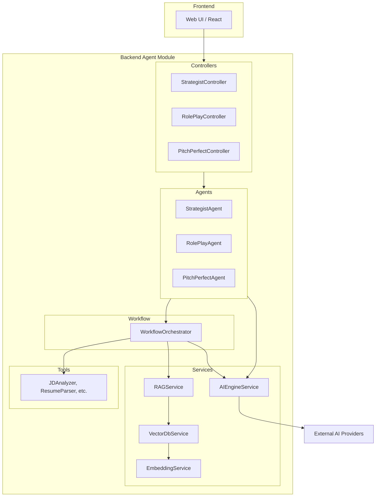

# Agent Module Architecture & Design

The `agent` module in `packages/backend/src/agent` is the core "intelligence" layer of the application. It follows a highly modular, service-oriented architecture designed for scalability, maintainability, and advanced AI capabilities.

## High-Level Architecture

The system is organized into several key layers:

1. **Controller Layer**: External entry points that handle HTTP requests.
2. **Agent Layer**: Specialized "brains" for specific business domains (Strategist, RolePlay, PitchPerfect).
3. **Workflow Layer**: Orchestrates complex, multi-step AI tasks.
4. **Service Layer**: Provides shared infrastructure (RAG, Vector DB, Embedding, Caching).
5. **Tool Layer**: Reusable atomic functions used by agents and workflows.

### System Overview

---

## Core Components

### 1. Specialized Agents

Each agent focuses on a specific aspect of the user's career journey:

- **`StrategistAgent`**: Analyzes the gap between a resume and a job description to build a custom interview question bank.
- **`RolePlayAgent`**: Manages the interactive interview session, maintaining state and simulating an interviewer.
- **`PitchPerfectAgent`**: Provides detailed feedback on user responses, focusing on content, delivery, and structure.

### 2. Workflow Orchestrator

The `WorkflowOrchestrator` handles the complexity of LLM operations:

- **Execution Modes**: Supports sequential, parallel, and conditional execution.
- **Resilience**: Implements error handling with fallback strategies.
- **Performance**: Caches intermediate results in Redis to reduce latency and API costs.
- **Observability**: Tracks token usage and latency per step.

### 3. RAG System (Retrieval-Augmented Generation)

The project uses RAG to ground AI responses in factual career knowledge:

- **`VectorDbService`**: Interfaces with a vector database (e.g., ChromaDB or pgvector) for similarity searches.
- **`EmbeddingService`**: Converts text into numerical vectors.
- **`RAGService`**: Combines retrieval with generation to provide context-aware answers.

---

## Project Calling Chain

The typical flow for an AI-powered request is as follows:

1. **Trigger**: User interacts with a feature on the frontend (e.g., "Start Interview").
2. **Entry**: The request hits a NestJS Controller (e.g., `StrategistController.buildQuestionBank`).
3. **Agent Logic**: The Controller calls the respective Agent (e.g., `StrategistAgent`).
4. **Workflow**: The Agent might delegate to the `WorkflowOrchestrator` if the task involves multiple steps (e.g., "Analyze JD" -> "Retrieve Questions" -> "Customize").
5. **Context**: The Orchestrator or Agent calls `RAGService` to get relevant background information.
6. **AI Execution**: `AIEngineService` is called to interact with the actual LLM (GPT, Gemini, etc.), handling different "tiers" (cost-optimized, quality-optimized).
7. **Processing**: The result is parsed, validated (using `JSONOutputHelper`), and tracked (using `UsageTrackerService`).
8. **Output**: The final refined response is returned to the user through the controller.

## Module Relationships & Dependencies

- **`AIProvidersModule`**: Provides the foundation for LLM interactions. The Agent module heavily depends on this for `AIEngineService` and `UsageTrackerService`.
- **`PrismaModule`**: Used for persisting user data, resumes, and interview histories.
- **`RedisModule`**: Used by the `WorkflowOrchestrator` for caching and session management.
- **`Tools`**: These are stateless utilities that agents use for atomic operations like parsing text or matching keywords.

---

## Design Principles

- **Separation of Concerns**: Logic for "how to interview" is separate from "how to talk to LLMs".
- **Cost Optimization**: Uses tiered model strategies and aggressive caching to minimize API expenses.
- **Type Safety**: Extensively uses TypeScript interfaces to ensure data consistency across the AI pipeline.
- **Grounding**: Relies on RAG to ensure the AI doesn't hallucinate career advice.
